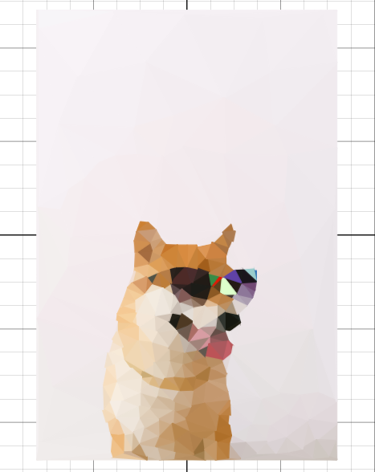

# Desmos Lowpoly
This is a python script to generate lowpoly of a image in a desmos graph. This uses selenium to open the browser and display the content.



## How to Run the Script

- **Clone the repo**
    ```
        git clone https://github.com/kapilpokhrel/DesmosLowpoly.git
        cd DesmosLowpoly
    ```
- **Install dependencies**
    - [**Optional**] Download browser driver for selenium.
    [Install browser drivers.](https://www.selenium.dev/documentation/webdriver/getting_started/install_drivers/)
    
        You can pass -nb flag to not open the browser and get the js expressions to run on browser yourself.

    - Install python packages
    ```
        pip install -r requirements.txt
    ```
- **Run the Script**
    ```
    python lowpoly.py dogimage.jpg
    ```
    If you wish to not use selenium to open browser, you can copy the code into the desmos calculator console.
    
    - Run
        ``` 
        python lowpoly.py dogimage.jpg -nb | xclip -selection clipboard 
        ```
    - Goto https://www.desmos.com/calculator
    - Open Inspect element (Press F12) and goto console tab.
    - Paste the code and hit enter.

    Sometimes when using more points you might want to wait sometimes after browser window opens before it starts drawing.

## Why Python with selenium instead of just using Javascript?

I know its tedious to clone the repo and install all dependencies just to see it open in a browser. But here are some reasons I chose python:
- I like the fact of being able to open the graph in actual desmos app that lets you save in your account and share instead of just seeing a graph.
- I did write it in Javascript to check but calculating entropy of a image was way too slow and I couldn't find any faster way to do it in JS.
- It's easy with everything already done for you by python packages. :grin:

----
Huge thanks to [this post.](http://www.degeneratestate.org/posts/2017/May/24/images-to-triangles/)